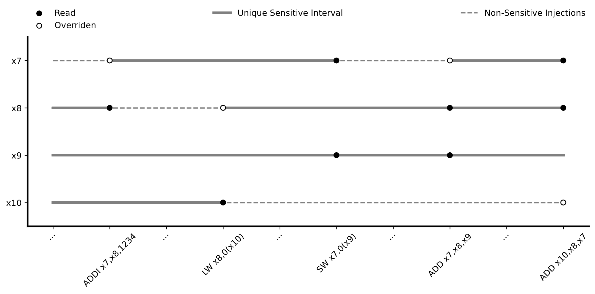
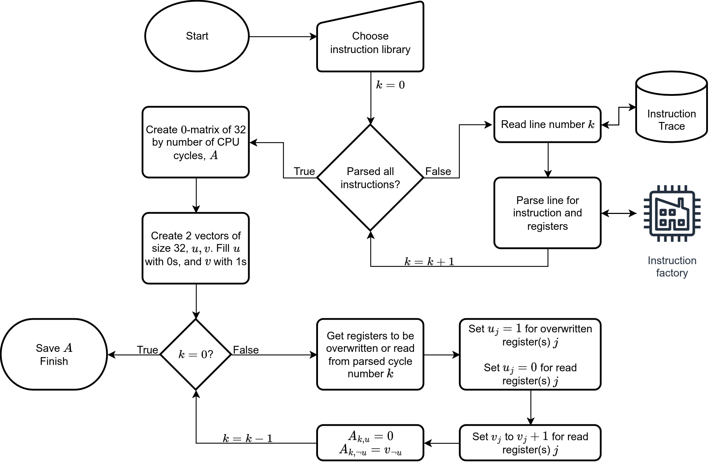

# PruneV

PruneV is a tool which reduces the injection space of the SEU injection simulation tool. This is done specifically for injections carried out on the register file of the processor core.

PruneV works by parsing an instruction trace of a firmware running on a given core. An example of the Coremark firmware running on an Ibex core is shown below.

| Time   | Cycle | PC       | Insn     | Decoded instruction | Register and memory contents |
| ------ | ----- | -------- | -------- | ------------------- | ---------------------------- |
| 80000  | 6     | 80000080 | 0040006f | jal     x0,80000084 | x0=0x00000000                |
| 90000  | 7     | 80000084 | 02040117 | auipc   x2,0x2040   | x2=0x82040084                |
| 100000 | 8     | 80000088 | f7c10113 | addi    x2,x2,-132  | x2:0x82040084  x2=0x82040000 |
| 110000 | 9     | 8000008c | 810002b7 | lui     x5,0x81000  | x5=0x81000000                |
| 120000 | 10    | 80000090 | 00028293 | addi    x5,x5,0     | x5:0x81000000  x5=0x81000000 |
| 130000 | 11    | 80000094 | 30529073 | csrrw   x0,mtvec,x5 | x5:0x81000000  x0=0x00000000 |
| 140000 | 12    | 80000098 | 08028293 | addi    x5,x5,128   | x5:0x81000000  x5=0x81000080 |
| 160000 | 14    | 8000009c | 00028067 | jalr    x0,0(x5)    | x5:0x81000080  x0=0x00000000 |
| 180000 | 16    | 81000080 | 0100006f | jal     x0,81000090 | x0=0x00000000                |

Some of these instructions are standard RISC-V instructions, which are supported by PruneV, and others are specific to the Ibex core, which are not supported as of now.

The working principles of PruneV is two-fold. The first is that a register is not sensitive between the cycles of one instruction, and another, if the latter instruction completely overrides the values of that register. An example of such an instruction is a load instruction which takes a value from memory, and stores it in the register. The second principle is that if a register is read from at cycle $M_0$ and $M_1>M_0$, the cycles in between those reads will result in identical functioning of the core if injected on. This idea is illustrated in the figure below.

## Using PruneV
To use PruneV the user must define the `custom_line_parser` function in the `main.py` script. This is only necessary if the user wants to parse lines not parsable by the custom `line_decoder` (which the user should create in the `line_and_decoders` folder, by following the pre-existing decoders).

The user should choose an instruction library from the `InstructionLibrary` enum type (new libraries should be added to this enum), and registers to exclude from the pruning. This is showcased in the `main.py` script as well.

The result object created by the `CoreTraceParser.parse()` method is a matrix, with the cycles of the instruction trace represented by the rows, and the registers represented by the columns. A 0-entry in this matrix indicates that the register is not sensitive at that given cycle, and a series of identical non-zero values indicate that a fault-injection on any of these cycles, for that register, will result in the same outcome for the simulation.

## PruneV Overview

Below is a flowchart, which should give an idea of how PruneV works.
